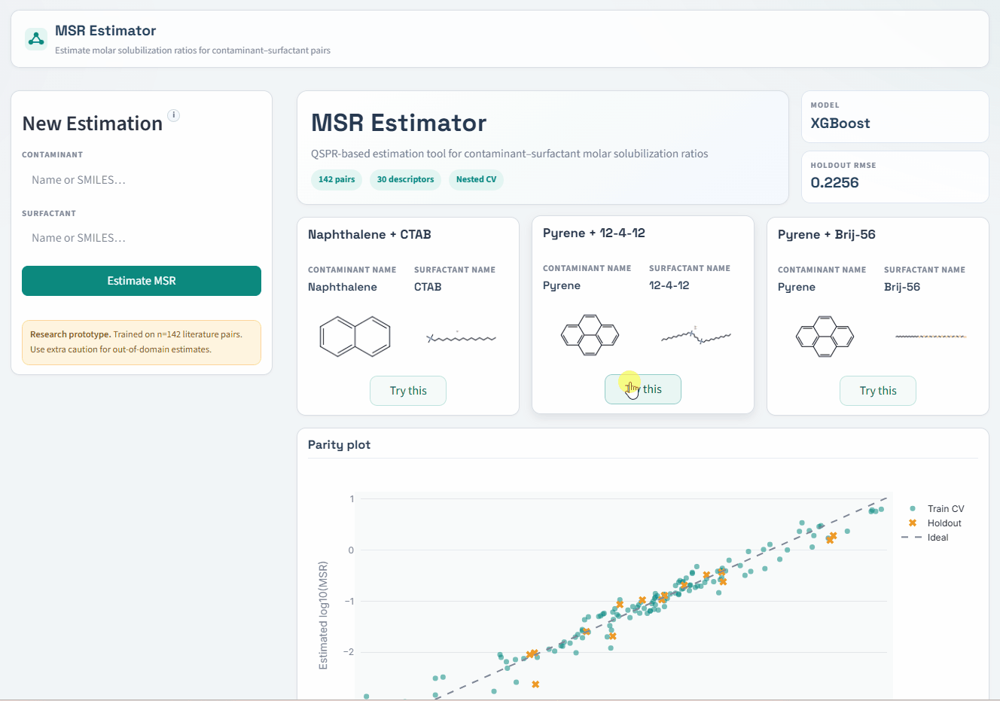

# Machine-learning QSPR modeling of molar solubilization ratios for surfactant-enhanced aquifer remediation

This repository contains a fully reproducible machine-learning pipeline to build and analyze QSPR models for the **molar solubilization ratio (MSR)** of contaminant–surfactant systems used in surfactant-enhanced remediation, including an interactive web app.



The code:

- computes 2D Mordred descriptors for contaminants and surfactants,
- builds a supervised learning dataset on **log10(MSR)**,
- performs **feature stability analysis** and selection,
- runs **nested cross-validation** for model comparison and hyperparameter tuning,
- trains a **final model** on the full CV set and evaluates it on a holdout set,
- generates **diagnostics** (Y-randomization, SHAP, and applicability domain).

All modeling is done on log10(MSR); metrics and plots are reported in this scale.


---

## 1. Repository structure

Main layout:

```text
.
├── data/
│   └── data.xlsx              # curated Excel dataset used by the pipeline
├── artifacts/
│   ├── data/                  # cached processed dataframe with descriptors
│   ├── feature_selection/
│   │   ├── stability_rankings/
│   │   ├── k_curves/
│   │   ├── summaries/
│   │   └── figures/
│   ├── model_selection/
│   │   ├── params/
│   │   ├── metrics/
│   │   └── summary/
│   ├── final_model/
│   │   ├── models/
│   │   ├── preds/
│   │   ├── metrics/
│   │   └── figures/
│   └── diagnostics/
│       ├── y_randomization/
│       └── shap/
├── config.py
├── data_prep.py
├── split_preproc.py
├── feature_selection.py
├── model_selection.py
├── final_model.py
├── diagnostics.py
├── transformers.py
├── plot_style.py
├── msr_pipeline.py
├── streamlit_app.py              # web app entry point
├── app_core.py                   # prediction engine used by   the app
├── app/
│   ├── styles.py                 # CSS and JS injection
│   ├── charts.py                 # Plotly chart factories
│   ├── components.py             # molecule rendering, modals, UI helpers
│   └── pages.py                  # welcome screen, prediction tabs, layout
├── requirements.txt
├── requirements_app.txt          # additional dependencies for the app
├── environment.msr-conda-env.yml
├── .gitignore
├── LICENSE
└── README.md
```

Short description of core modules:

- `config.py` – paths, seeds, global configuration, and directory creation.
- `data_prep.py` – load raw Excel, clean table, canonicalize SMILES, compute Mordred descriptors, build full dataframe.
- `split_preproc.py` – build design matrices, create CV/holdout split, define and build the preprocessing pipeline.
- `transformers.py` – custom pandas-friendly transformers (drop-mostly-NaN, imputer, safe log10, correlation filter, etc.).
- `feature_selection.py` – feature stability analysis, per-fold k selection, and global feature set construction.
- `model_selection.py` – nested CV with Optuna hyperparameter tuning for RF, GB, XGB, SVR, and KNN.
- `final_model.py` – tuning of the best model on the full CV set, training of the final model, holdout evaluation and parity plot.
- `diagnostics.py` – Y-randomization and SHAP diagnostics for the final model.
- `plot_style.py` – global plotting style (seaborn + matplotlib).

---

## 2. Data

The pipeline expects a single Excel file:

- Path: `data/data.xlsx`
- Sheet name: `full_dataset`
- Columns A:I, with the header row at `HEADER_ROW = 10` (0-based indexing used by pandas).

Key columns after cleaning and renaming:

- `Contaminant`, `ContaminantType`, `SMILES_contaminant`
- `Surfactant`, `SurfactantType`, `SMILES_surfactant`
- `CMC` (surfactant CMC in mol/L)
- `WaterSolubility` (contaminant water solubility in g/L)
- `MSR` (molar solubilization ratio; strictly positive)

---

## 3. Environment and installation

The code was developed and tested with:

- Python **3.9**
- `numpy==1.23.5`
- `pandas==1.5.3`
- `scikit-learn==1.2.2`
- `scipy==1.10.1`
- `mordred==1.2.0`
- `rdkit-pypi==2022.9.5`
- `xgboost==1.6.2`
- `shap==0.41.0`
- `openpyxl==3.1.2`
- `matplotlib`, `seaborn`, `optuna` and related dependencies

Setup (choose one path):

```bash
# conda (recommended)
conda env create -f environment.msr-conda-env.yml
conda activate msr-conda-env

# venv (fallback)
python3.9 -m venv .venv
source .venv/bin/activate    # on Windows: .venv\Scripts\activate
python -m pip install --upgrade pip
python -m pip install -r requirements.txt
```

Due to Mordred, using Python 3.9 (or the exact versions listed in `requirements.txt`) is necessary for reproducibility.

If you want to force recomputation of specific stages instead of reusing cached artifacts,
set the corresponding keys in `FORCE_RECOMPUTE` in `config.py` to `True`.

---

## 4. How to run the full pipeline

From the project root:

```bash
python msr_pipeline.py
```

The script performs the complete workflow:

1. **Data + descriptors**
   - Load raw Excel.
   - Clean and normalize column names.
   - Canonicalize contaminant and surfactant SMILES (main organic fragment).
   - Compute 2D Mordred descriptors for both molecules.
   - Cache resulting dataframe as a pickle under `artifacts/data/` so descriptors are not recomputed on subsequent runs.

2. **Split CV / holdout**
   - Build design matrices (`X`, `y=MSR`, metadata).
   - Create a **stratified** 90/10 split (`X_cv`, `X_holdout`) using quantile bins of MSR.
   - Compute `log10(MSR)` for CV and holdout (`y_cv_log`, `y_holdout_log`).

3. **Preprocessing**
   - Define feature roles (categorical vs. log-transformed).
   - Build preprocessing pipeline:
     - drop mostly-NaN columns,
     - impute numeric columns,
     - apply log10 to selected physicochemical variables,
     - one-hot encode categorical variables,
     - remove zero-variance features,
     - filter highly correlated features.
   - Preprocessing is refit inside each CV split to avoid leakage.

4. **Feature stability and k selection**
   - Outer CV folds are created on the CV set.
   - For each outer fold:
     - fit preprocessing on outer-train,
     - bootstrap the preprocessed data,
     - run `RandomForestRegressor + SelectFromModel`,
     - record selection frequencies and save a stability ranking.
   - For each outer fold, perform a k-curve analysis:
     - take top-k features from the per-fold ranking,
     - evaluate `RF` in inner repeated stratified CV for each k in a grid,
     - select the smallest k whose median R² ≥ `K_COVER * max(R²)`.
   - Aggregate `k*` over folds and define `k_global` as the median.
   - Build the **final feature set** from stability rankings, clipped/padded to `k_global`.

5. **Nested model selection**
   - For each outer fold:
     - fix the top-`k_global` per-fold feature set,
     - for each candidate model (RF, GB, XGB, SVR, KNN):
       - tune hyperparameters with Optuna (inner CV, objective = median(−RMSE)),
       - save best params per model and fold,
       - refit tuned model on outer-train and evaluate on outer-test.
   - Save per-fold metrics and a summary table with mean ± std of R² and RMSE.
   - Select the **best model family** by mean outer R².

6. **Final model and holdout evaluation**
   - Restrict to the final feature set.
   - Tune the chosen model family on the full CV set (new inner CV, Optuna).
   - Fit the final pipeline on the full CV data.
   - Save:
     - fitted pipeline (`.joblib`),
     - CV and holdout predictions on log10(MSR),
     - CV and holdout metrics (R², RMSE on log scale),
     - parity plot with CV (train) and holdout (test) points.

7. **Diagnostics**
   - **Y-randomization**:
     - keep preprocessing, feature set, and hyperparameters fixed,
     - compute baseline CV median R² for real `y`,
     - run multiple permutations of `y` and recompute CV median R²,
     - save results and histogram (permuted R² distribution + real R²).
   - **SHAP**:
     - load final pipeline and apply preprocessing to `X_cv`,
     - compute SHAP values for the final model,
     - save global importance (mean |SHAP| per feature),
     - export bar plot and beeswarm plot using the project’s seaborn/matplotlib style.
   - **Applicability domain (AD)**:
     - assess structural coverage (k-NN distance to training set),
     - check y-range (prediction within observed target range),
     - estimate local prediction error (median error of nearest neighbors),
     - flag out-of-domain predictions and save AD results.

Stage-level cache bypass (recompute) behavior is controlled centrally in
`config.py` via the `FORCE_RECOMPUTE` dictionary.

---

## 5. Reproducibility

- All random operations use a global `SEED` defined in `config.py`.
- Stratification in splitting and CV is based on quantile bins of MSR.
- Descriptor computation and the full modeling dataframe are cached to disk.
- Hyperparameter search spaces and numbers of trials are fixed in code (`PARAM_SPACES`, `TRIALS_MAP`).

Given the same Python version, dependencies, raw Excel file and configuration, the pipeline should reproduce the same results up to minor floating-point variation.

---

## 6. Streamlit web app (optional)

This repository includes an interactive Streamlit interface for MSR prediction:

- App entry point: `streamlit_app.py`
- Core predictor module: `app_core.py`

### 6.1 App environment

From repository root:

```bash
python3.9 -m venv .venv
source .venv/bin/activate
python -m pip install --upgrade pip
python -m pip install -r requirements_app.txt
```

### 6.2 Required artifacts

The app expects these files under `artifacts/` (or a directory set with `MSR_ARTIFACTS_DIR`):

- `final_model/models/xgboost_final_model.joblib`
- `data/full_dataset_with_descriptors.pkl`

If they are missing, run:

```bash
python msr_pipeline.py
```

### 6.3 Run app

```bash
streamlit run streamlit_app.py
```

## 7. Citation

If you use this model in your research, please cite:

(Full citation with DOI will be added after publication.)

## 8. License

This repository is released under the MIT License. See the `LICENSE` file for details.
